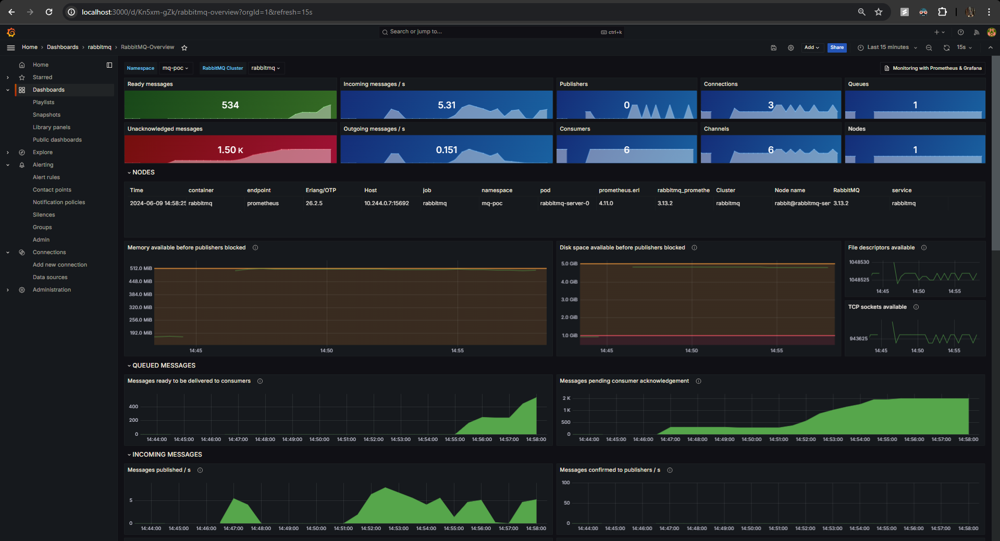
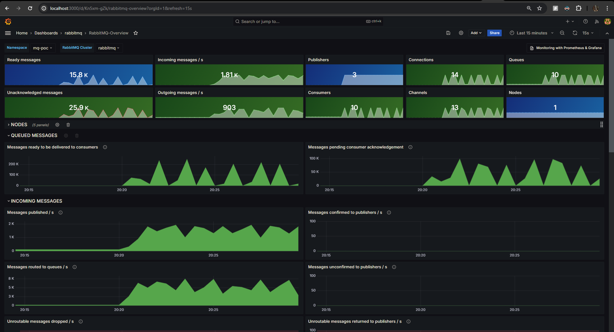

# Working with RabbitMQ on Kubernetes

In this guide, we explore the setup of RabbitMQ with multiple producers and consumers, deployment on Kubernetes, and monitoring using Prometheus and Grafana.

## Overview of the setup

### Architecture

The setup consists of:
- **2 Producer Services**: Each submits messages at a specified interval.
- **3 Consumer Services**: Each service has two worker threads processing messages.
- **RabbitMQ**: A message queue facilitating communication between producers and consumers.

### Components

1. **Producers**
    - Send messages at intervals defined by `SUBMISSION_INTERVAL`.
    - Append a random number to each message to simulate varying processing durations.
    - Produce a limited number of messages, controlled by `SUBMISSION_COUNT`.

2. **Consumers**
    - Each consumer service has two threads.
    - Simulate processing by waiting for the duration specified in the message.

3. **RabbitMQ**
    - Runs on port 5672. For other containers, use `rabbitmq` as the host.
    - Management dashboard accessible at `localhost:15672`.

## Local development

To start the entire setup using Docker Compose, follow these steps:

1. **Ensure Docker and Docker Compose are installed**:
    - [Install Docker](https://docs.docker.com/get-docker/)
    - [Install Docker Compose](https://docs.docker.com/compose/install/)

2. **Clone the Repository**:
    ```bash
    git clone https://github.com/chaitanyawho/rabbitmq-guide.git
    cd rabbitmq-guide
    ```
   
   The same source code will be used for producers and consumers. Running the Spring Boot app with the `producer` profile will create the producer bean (see [Config.java](src/main/java/boilerplate/stack/rabbitmq/Config.java)), whereas running it with the `consumer` profile creates 2 consumer objects to ingest messages from the configured RabbitMQ queue.


3. **Start the Services**:
    ```bash
    mvn clean package
    docker compose up -d
    ```
    These commands will build the source code and create a jarfile in the /target folder. The dockerfile for the producer and consumer services relies on this jarfile to build the respective docker images.
    The next command will start all the defined services (producers, consumers, and RabbitMQ) in detached mode.
    The [`docker-compose.yaml`](docker-compose.yaml) file defines and configures multiple services to run within Docker containers. This file specifies the setup of a RabbitMQ message broker along with multiple producer and consumer services that interact with RabbitMQ. Docker Compose orchestrates the starting, stopping, and managing of these services.

4. **Optionally, to run specific services**:
    ```bash
    docker compose up -d [service-name]
    ```
   Replace `[service-name]` with the name of the service you want to run, as defined in the `docker-compose.yml` file.

### Inspecting the Setup

- **RabbitMQ Management Dashboard**:
  Access it at `http://localhost:15672`. The default username and password are `guest` and `guest`.
- **Logs and Status**:
  Use `docker compose logs` and `docker compose ps` to check the logs and status of the running services.

## Deployment on Kubernetes

### Prerequisites

1. You are logged into your CSP portal and have access to a running K8s cluster
2. You have the `kubectl` and `helm` commands installed on your terminal

To deploy the setup on a Kubernetes cluster, follow these steps:

### 1. Set Up RabbitMQ

1. **Deploy the RabbitMQ Cluster Operator**:
    ```bash
    kubectl apply -f k8s/rabbitmq-definition.yaml -n mqg-ns
    ```
   This command applies the RabbitMQ cluster definition to your Kubernetes cluster in the `mqg-ns` namespace. The [RabbitMQ Cluster Kubernetes Operator](https://www.rabbitmq.com/kubernetes/operator/operator-overview) automates provisioning, management, and operations of RabbitMQ clusters running on Kubernetes.

2. **Verify the Operator is Running**:
    ```bash
    kubectl get all -n mqg-ns
    ```
   This command lists all the resources in the `mqg-ns` namespace, helping you verify that the RabbitMQ operator and related resources are up and running.

### 2. Launch Producers and Consumers


0. **Prerequisite: Building and Pushing Docker Images**

    Before deploying the producers and consumers on Kubernetes, ensure that you have built and pushed the Docker images for both the producer and consumer services. You can use Docker Compose to simplify this process:

    -   Build Docker Images
        Use Docker Compose to build the images for the producer and consumer services:

        ```bash
        docker-compose build
        ```

    - Push Docker Images
        After building the images, push them to your Docker registry:
        ```bash
        docker-compose push
        ```
        This command pushes the Docker images to the registry, making them available for deployment on Kubernetes.

        > Make sure to update the image field in your Kubernetes deployment files to reference the pushed images correctly.  


1. **Deploy the Producers**:
    ```bash
    kubectl apply -f k8s/producer1-deployment.yaml
    ```
   This command creates the producer deployments, which start sending messages to the RabbitMQ queue.

2. **Deploy the Consumers**:
    ```bash
    kubectl apply -f k8s/consumer1-deployment.yaml
    ```
   This command creates the consumer deployments, which start processing messages from the RabbitMQ queue.

_Note: See [Using kompose](#converting-docker-composeyml-to-kubernetes-deployment-files-using-kompose) for converting the locally developed docker-compose.yaml to K8s deployment files_
### Verify the Deployment and Monitor

- **Check the Status of Deployments**:
    ```bash
    kubectl get deployments -n mqg-ns
    ```
  This command lists the status of all deployments in the `mqg-ns` namespace.

- **Monitor Logs**:
    ```bash
    kubectl logs -f deployment/producer1-deployment -n mqg-ns
    ```
  Replace `producer1-deployment` with the specific deployment name to view real-time logs.

-  **View RabbitMQ Management Dashboard**:
    To access the RabbitMQ management dashboard, you need to use port forwarding:
    ```bash
    kubectl port-forward svc/rabbitmq 15672:15672 -n mqg-ns
    ```
    This command forwards port 15672 of the RabbitMQ service to your local machine, making the management dashboard accessible at `http://localhost:15672`.


## Monitoring RabbitMQ with Prometheus and Grafana

Here, we will install and configure the `Prometheus` stack to monitor our RabbitMQ cluster and visualize key metrics with `Grafana`. Prometheus supports multidimensional data collection and data queuing. It's reliable and allows you to quickly diagnose problems and identify bottlenecks in your k8s architecture.

### 1. Set Up Prometheus Stack

first, we will install the kube-prometheus stack, which is an opinionated full monitoring stack for Kubernetes. It includes the Prometheus Operator, kube-state-metrics, pre-built manifests, Node Exporters, Metrics API, the Alerts Manager and Grafana.

1. **Add the Prometheus Helm Repository**:
    ```bash
    helm repo add prometheus-community https://prometheus-community.github.io/helm-charts
    helm repo update prometheus-community
    ```
   These commands add and update the Prometheus Helm chart repository.

2. **Install the Prometheus Stack**:
    ```bash
    helm install kube-prom-stack prometheus-community/kube-prometheus-stack --version "60.0.1" -n mqg-ns -f k8s/monitoring/prom-stack-values.yaml
    ```
   This command installs the Prometheus stack, including Prometheus, Alertmanager, and Grafana, in the `mqg-ns` namespace. The `prom-stack-values.yaml` file contains configuration values for the stack.

3. **Verify the Installation**:
    ```bash
    kubectl get prometheus -n mqg-ns
    ```
    Verify that the prometheus stack is up and running

### 2. Configure ServiceMonitor and PodMonitor for RabbitMQ

1. **Apply RabbitMQ ServiceMonitor and PodMonitor**:
    ```bash
    kubectl apply -n mqg-ns -f https://raw.githubusercontent.com/rabbitmq/cluster-operator/main/observability/prometheus/monitors/rabbitmq-servicemonitor.yml
    kubectl apply -n mqg-ns -f https://raw.githubusercontent.com/rabbitmq/cluster-operator/main/observability/prometheus/monitors/rabbitmq-cluster-operator-podmonitor.yml
    ```
   These commands set up monitoring for RabbitMQ by creating ServiceMonitor and PodMonitor resources that Prometheus uses to scrape metrics.

### 3. Access Grafana Dashboards

1. **Forward Grafana Service to Localhost**:
    ```bash
    kubectl port-forward svc/kube-prom-stack-grafana 3000:80 -n mqg-ns
    ```
   This command makes Grafana accessible at `http://localhost:3000`.

2. **Import RabbitMQ Dashboards**:
    - Open Grafana in your browser (`http://localhost:3000`).
    - Log in (default username and password are `admin` and `admin`).
    - Go to **Dashboards** > **Manage** > **Import**.
    - Enter the dashboard ID (e.g., [RabbitMQ Overview](https://grafana.com/grafana/dashboards/10991-rabbitmq-overview/)).
    - Select Prometheus as the data source to visualize RabbitMQ metrics.

    **Grafana Dashboard for RabbitMQ Overview**

    

## Appendix

### Final K8s Stack 

```text
chaitanya@bifrost:/mnt/c/Projects/rabbitmq-guide$ kubectl get all -n mqg-ns
NAME                                                         READY   STATUS    RESTARTS   AGE
pod/alertmanager-kube-prom-stack-kube-prome-alertmanager-0   2/2     Running   0          6d13h
pod/kube-prom-stack-grafana-6b9f89c5f8-9lmgn                 3/3     Running   0          6d13h
pod/kube-prom-stack-kube-prome-operator-78697b7f55-lchsj     1/1     Running   0          6d13h
pod/kube-prom-stack-kube-state-metrics-65545586bc-htsf4      1/1     Running   0          6d13h
pod/perf-test-dxqc2                                          1/1     Running   0          2d5h
pod/prometheus-kube-prom-stack-kube-prome-prometheus-0       2/2     Running   0          6d13h
pod/rabbitmq-server-0                                        1/1     Running   0          2d9h

NAME                                              TYPE        CLUSTER-IP     EXTERNAL-IP   PORT(S)                        AGE
service/alertmanager-operated                     ClusterIP   None           <none>        9093/TCP,9094/TCP,9094/UDP     6d13h
service/kube-prom-stack-grafana                   ClusterIP   10.0.88.216    <none>        80/TCP                         6d13h
service/kube-prom-stack-kube-prome-alertmanager   ClusterIP   10.0.130.187   <none>        9093/TCP,8080/TCP              6d13h
service/kube-prom-stack-kube-prome-operator       ClusterIP   10.0.109.1     <none>        443/TCP                        6d13h
service/kube-prom-stack-kube-prome-prometheus     ClusterIP   10.0.98.170    <none>        9090/TCP,8080/TCP              6d13h
service/kube-prom-stack-kube-state-metrics        ClusterIP   10.0.26.229    <none>        8080/TCP                       6d13h
service/prometheus-operated                       ClusterIP   None           <none>        9090/TCP                       6d13h
service/rabbitmq                                  ClusterIP   10.0.79.21     <none>        5672/TCP,15672/TCP,15692/TCP   2d9h
service/rabbitmq-nodes                            ClusterIP   None           <none>        4369/TCP,25672/TCP             2d9h

NAME                                                  READY   UP-TO-DATE   AVAILABLE   AGE
deployment.apps/kube-prom-stack-grafana               1/1     1            1           6d13h
deployment.apps/kube-prom-stack-kube-prome-operator   1/1     1            1           6d13h
deployment.apps/kube-prom-stack-kube-state-metrics    1/1     1            1           6d13h

NAME                                                             DESIRED   CURRENT   READY   AGE
replicaset.apps/kube-prom-stack-grafana-6b9f89c5f8               1         1         1       6d13h
replicaset.apps/kube-prom-stack-grafana-97b6f4b5b                0         0         0       6d13h
replicaset.apps/kube-prom-stack-kube-prome-operator-78697b7f55   1         1         1       6d13h
replicaset.apps/kube-prom-stack-kube-state-metrics-65545586bc    1         1         1       6d13h

NAME                                                                    READY   AGE
statefulset.apps/alertmanager-kube-prom-stack-kube-prome-alertmanager   1/1     6d13h
statefulset.apps/prometheus-kube-prom-stack-kube-prome-prometheus       1/1     6d13h
statefulset.apps/rabbitmq-server                                        1/1     2d9h

NAME                  COMPLETIONS   DURATION   AGE
job.batch/perf-test   0/1           2d5h       2d5h

NAME                                    ALLREPLICASREADY   RECONCILESUCCESS   AGE
rabbitmqcluster.rabbitmq.com/rabbitmq   True               True               2d9h

```

### Performance Testing with `perf-test`

To test RabbitMQ performance, use the `perf-test` command:

```bash
kubectl rabbitmq -n mqg-ns perf-test rabbitmq -vr 1000:20 -vr 300:20 -vs 1000:30 -vs 300:10 -vl 10000000:60 -vl 10000:20 --producers 3 --consumers 10
```
- **rabbitmq**: This is a [plugin](https://www.rabbitmq.com/kubernetes/operator/kubectl-plugin) to manage the RabbitMQ Cluster Operator on K8s
- **perf-test**: This is a load testing tool that ships with the cluster operator for RMQ. See [perftest](https://perftest.rabbitmq.com/)
- **-vr 1000:20 -vr 300:20**: variable publish rate of 1000msgs/sec for the first 20s, and then 300msgs/sec for the next 20s
- **-vs 1000:30 -vs 300:10**: this option allows to specify different message sizes for periods of time
- **-vl 10000000:60 -vl 10000:20**: option sets a variable consumer latency. In this case it is set to 10s for 60 seconds then 1 second for 20 seconds:
- **--producers 3 --consumers 10**: Sets the number of producers and consumers to be used in the performance test.

**Visualizing the system during this perf-test**


### Converting `docker-compose.yml` to Kubernetes Deployment Files Using `kompose`

To convert your `docker-compose.yml` file to Kubernetes deployment files, you can use `kompose`. Here are the steps:

1. **Install Kompose**:
    - Follow the [installation instructions](https://kompose.io/installation/) for your operating system.

2. **Convert Docker Compose File**:
    ```bash
    kompose convert -f docker-compose.yml
    ```
    This command converts the `docker-compose.yml` file to Kubernetes deployment files. The output will include a set of YAML files that define Kubernetes services, deployments, and other necessary resources.

3. **Apply the Converted Files**:
    ```bash
    kubectl apply -f .
    ```
    This command applies the generated Kubernetes YAML files to your cluster, creating the necessary deployments and services.
